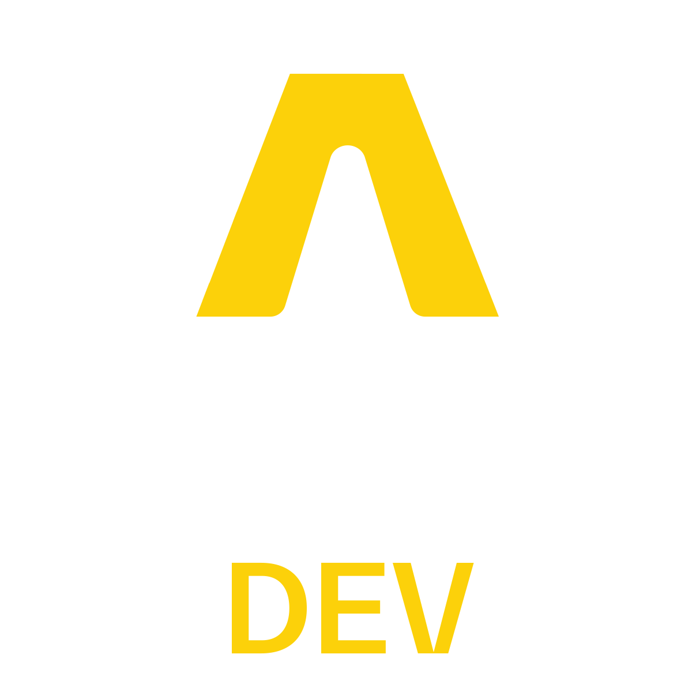

<div align="center" dir="rtl">



# أطلس ديف — AtlasDev

**هندسة برمجيات موثوقة**

نبني حلول Laravel وVue وFlutter مخصصة للشركات في الأسواق العربية والعالمية.

[الموقع](https://atlasdev.tech) — [تواصل معنا](mailto:info@atlasdev.tech)

</div>

---

<div dir="rtl">

## نبذة عن الشركة

**أطلس ديف** شركة هندسة برمجيات مقرها في **الإمارات العربية**. نبني حلول برمجية مخصصة تعتمد على **Laravel** و**Vue.js** و**Flutter**.

نحن متخصصون في الأنظمة المؤسسية المعقدة: مثل أنظمة المحاسبة والمستودعات وإدارة الموارد في بيئات عمل متعددة اللغات (عربي / إنجليزي) ومعايير أمان على مستوى عالٍ.

> أطلس ديف — هندسة برمجيات موثوقة. حلول مخصصة Laravel وVue وFlutter للشركات في الأسواق العربية والعالمية.

</div>

## الخلاصة

أطلس ديف شركة هندسة برمجيات تقدم حلول أنظمة أعمال متكاملة للشركات: أنظمة ERP، أنظمة نقاط البيع، المستودعات، المحاسبة، وإدارة الموارد البشرية. نعتمد المعمارية المؤسسية والمعايير الصناعية في بناء الأنظمة.

| | |
|---|---|
| **المقر** | الإمارات العربية |
| **التقنيات** | Laravel — Vue 3 — Flutter — MySQL — PostgreSQL |
| **النطاق** | الأسواق الإقليمية |
| **الموقع** | [atlasdev.tech](https://atlasdev.tech) |

---

<div dir="rtl">

## الخدمات

- **أنظمة Laravel مخصصة** — ERP محاسبي كامل وCRM وإدارة موارد بشرية على MySQL وPostgreSQL.
- **لوحات تحكم من Vue.js** — واجهات إدارية مبنية على Vue 3 وInertia أو تطبيقات SPA مع Tailwind CSS.
- **تطبيقات Flutter متكاملة** — iOS وAndroid متصلة بنفس الـ API المبني على خادم Laravel.
- **أنظمة نقاط البيع والمستودعات** — أنظمة المبيعات والمخزون والمستودعات لنقاط التجزئة.
- **تكامل API والاستيراد** — ربط أنظمة المحاسبة وCRM عبر واجهات برمجة REST.
- **دعم فني وصيانة** — استضافة آمنة وتحديثات مستمرة بعد الإطلاق.

## آلية العمل

1. **اكتشاف المتطلبات** — اجتماع أول للمتطلبات والاستكشاف خلال 30 دقيقة.
2. **عرض سعر ومقترح** — نرسل مقترح عمل خلال 48 ساعة.
3. **اتفاق على النطاق** — نثبت نطاق عمل واضح.
4. **التسليم والدعم** — نشر بعد الإطلاق مع صيانة في إطار زمني محدد.

## أنظمة من الشركة

| النظام | المجال |
|---|---|
| TableMaster | نظام المطاعم |
| ShopNest | نظام التجارة الإلكترونية |
| EduGame | نظام التعليم |
| الصيدلية / MedStock | نظام الصيدليات |
| RentFlow | نظام العقارات |
| TransitHub | النقل الذكي |
| EduCare | نظام المدارس |
| WareFlow | نظام المستودعات |
| StaffHub | نظام الموارد البشرية |
| BahasaKu | نظام اللغة |

## هيكل المشروع

```
Atlasdev/
├── default.html              الصفحة الرئيسية (عربي / إنجليزي)
├── project-details.html      صفحات المشاريع
├── logo/                     شعار أطلس ديف
├── lina-ahmad-ghojan/        ملفات المشاريع والمعارض
├── brand identity/           هوية العلامة التجارية
├── sitemap.xml
├── robots.txt
```

## التشغيل المحلي

افتح الملف مباشرة في المتصفح:

```bash
# Windows
start default.html
```

أو شغّل خادم محلي خفيف:

```bash
npx serve .
```

ثم افتح [http://localhost:3000/default.html](http://localhost:3000/default.html)

- المحتوى يظهر باللغة الافتراضية.
- الإنجليزية: `default.html?lang=en`

## التواصل

- البريد: [info@atlasdev.tech](mailto:info@atlasdev.tech)
- واتساب الإمارات: [+971 52 485 9625](https://wa.me/971524859625)
- واتساب سوريا: [+963 995 019 487](https://wa.me/963995019487)

نرد خلال 24 ساعة — نستقبل الاستفسارات.

<br>

<p align="center">© 2026 AtlasDev — هندسة برمجيات موثوقة — الإمارات العربية</p>

</div>
